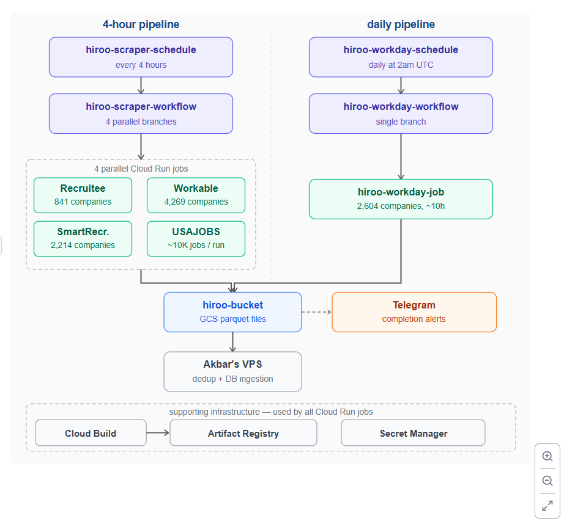

raw
Readme · MD
# hiroo-scraper
 
A production ATS scraping pipeline on Google Cloud Platform that processes **1.95 million job records daily** across 5 platforms, covering ~893K unique active job listings. Two separate pipelines run on automated schedules, write partitioned Parquet files to Cloud Storage, and notify via Telegram on completion.
 
Built for [Hiroo](https://gethiroo.netlify.app/) — an AI job search agent for students that applies, networks, and follows up automatically. This pipeline is what keeps its job listings fresh.
 
---
 
## What it does
 
The pipeline scrapes job listings directly from ATS (Applicant Tracking System) platforms rather than aggregators like LinkedIn or Indeed. This means one source of truth per job — no duplicates, no ghost listings, no reposts. Every row comes from the company's own ATS.
 
Two pipelines run on separate schedules:
 
- **4-hour pipeline** — scrapes Recruitee, Workable, SmartRecruiters, and USAJOBS in parallel, 6 times per day
- **Daily pipeline** — scrapes Workday separately at 2am UTC; runs alone because 2,604 companies × ~10 hours cannot fit inside a 4-hour window
Each run scrapes the full current state of each ATS. No delta detection. This is intentional — jobs change (title, location, salary) and disappear. Full scrapes let the downstream dedup layer detect both additions and deletions.
 
---
 
## Architecture
 
!
 
```
Cloud Scheduler (every 4h)          Cloud Scheduler (daily 2am UTC)
        ↓                                       ↓
hiroo-scraper-workflow              hiroo-workday-workflow
(Cloud Workflows)                   (Cloud Workflows)
        ↓                                       ↓
4 parallel Cloud Run Jobs           hiroo-workday-job
├── hiroo-recruitee-job             (2,604 companies, ~10h)
├── hiroo-workable-job                          ↓
├── hiroo-smartrecruiters-job                   ↓
└── hiroo-usajobs-job                           ↓
        ↓                                       ↓
        └──────────────┬─────────────────────────┘
                       ↓
             hiroo-bucket (GCS)
             source=X/dt=YYYY-MM-DD/
                       ↓
               Telegram notification
                       ↓
               Downstream VPS
               (dedup + DB ingestion)
```
 
Supporting infrastructure used by all Cloud Run jobs:
 
```
Cloud Build → Artifact Registry (Docker image)
Secret Manager (telegram-bot-token, usajobs-api-key, usajobs-email)
```
 
---
 
## Sources and Scale
 
| Source | ATS platform | Companies | Jobs per run | Frequency |
|---|---|---|---|---|
| Recruitee | Recruitee API | 841 | ~14K | 6x / day |
| Workable | Workable API | 4,269 | ~15K | 6x / day |
| SmartRecruiters | SmartRecruiters API | 2,214 | ~174K | 6x / day |
| USAJOBS | USAJOBS.gov API | — | ~10K | 6x / day |
| Workday | Workday (via jobhive) | 2,604 | ~680K | 1x / day |
 
**~893K unique active job listings** scraped per cycle. **1.95M rows written to GCS per day** across all runs.
 
Company lists for Recruitee, Workable, SmartRecruiters, and Workday come from [jobhive](https://github.com/stapply-ai/ats-scrapers) (MIT licensed), which maintains a pre-built manifest of known ATS company URLs. USAJOBS is scraped via their public REST API with key-based auth.
 
---
 
## Data Schema
 
All 5 sources write Parquet files with the same schema. Files are partitioned as `source=X/dt=YYYY-MM-DD/` in the GCS bucket.
 
| Column | Type | Nullable | Notes |
|---|---|---|---|
| `source` | string, max 24 | No | `recruitee` \| `workable` \| `smartrecruiters` \| `usajobs` \| `workday` |
| `external_id` | string, max 200 | No | Native ATS job ID. Dedup key with `source`. |
| `company` | string, max 180 | No | Company name |
| `title` | string, max 240 | No | Job title |
| `url` | string, max 500 | No | Direct URL to the posting |
| `location` | string, max 180 | No (use `""`) | Empty string if absent, never null |
| `department` | string, max 180 | No (use `""`) | Empty string if absent, never null |
| `description` | text | No (use `""`) | HTML-stripped full description |
| `posted_at` | datetime UTC | Yes | ISO 8601. Null acceptable. |
| `employment_type` | enum | Yes | `full_time` \| `internship` \| `part_time` \| `contract` |
 
Dedup key: `(source, external_id)`. `is_active` and `fetched_at` are set downstream.
 
---
 
## Pipeline Design
 
**Why full scrape every run, not delta**
 
Most ATS APIs do not expose a "changed since timestamp X" endpoint — they return current active listings only. To detect job deletions you must compare the full current state against the previous state. Delta-only scraping catches additions but misses updates (salary changes, location changes) and deletions entirely. The downstream dedup layer handles new vs existing by keying on `(source, external_id)`.
 
**Why Workday runs on a separate daily schedule**
 
2,604 Workday company instances scraped via jobhive takes ~10 hours end to end. This cannot fit inside a 4-hour window. A separate schedule with a 24-hour task timeout gives it headroom without blocking the main pipeline.
 
**Why checkpointing in SmartRecruiters and Workday**
 
At 2,214 and 2,604 companies respectively, transient failures mid-run are expected. Checkpointing every 500 companies (SmartRecruiters) and 50 (Workday) ensures partial data lands in GCS even if the job fails before completing. Workday catches per-company exceptions and continues — one slow instance does not abort the run.
 
**Why a dedicated service account**
 
The default GCP compute service account has broad project-level permissions. `hiroo-scraper-sa` is granted only what it needs: `objectAdmin` scoped to `hiroo-bucket` only, `secretAccessor` scoped to the 3 specific secrets, `run.invoker` and `workflows.invoker` at project level. A compromised container can only touch the bucket and its own secrets.
 
**Why objectAdmin instead of objectCreator on the bucket**
 
`objectCreator` can write new objects but cannot overwrite existing ones. The `run_stats/*.txt` files (one per source) are overwritten on every run with the latest row count. `objectCreator` would fail on the second run for each stats file.
 
**Why no BigQuery**
 
The downstream partner reads raw Parquet directly from GCS on their VPS and handles dedup and ingestion themselves. Adding a BigQuery load step would introduce an extra service, extra cost, and an extra failure point with no benefit. The raw Parquet schema is clean and consistent across all sources.
 
**Why a single Docker image for all scrapers**
 
All 5 scripts share the same dependencies. One image means one build, one push, and one update command when dependencies change. Each Cloud Run Job overrides the entry point via `--command` at creation time — so the same image runs `python recruitee.py` or `python workday.py` depending on which job calls it.
 
**The objectCreator mistake**
 
Each scraper writes a small stats file to GCS after every run recording how many rows it collected. Same file path, overwritten each time. The bucket permission was initially set to `objectCreator` instead of `objectAdmin`. `objectCreator` can create new files but cannot overwrite existing ones. The first run worked. The second run failed on every stats file write. One permission name difference, caught after one failed run.
 
---
 
## GCP Infrastructure
 
| Resource | Details |
|---|---|
| Project | hiroo-498020 |
| Region | us-central1 |
| Cloud Storage | `gs://hiroo-bucket` — Parquet files, partitioned `source=X/dt=YYYY-MM-DD/` |
| Artifact Registry | `hiroo-repo` — single image `hiroo-scraper:latest` |
| Cloud Run Jobs | 5 jobs: recruitee, workable, smartrecruiters, usajobs, workday |
| Cloud Workflows | 2 workflows: `hiroo-scraper-workflow`, `hiroo-workday-workflow` |
| Cloud Scheduler | 2 schedules: `0 */4 * * *` and `0 2 * * *` |
| Secret Manager | 3 secrets: `telegram-bot-token`, `usajobs-api-key`, `usajobs-email` |
| Service account | `hiroo-scraper-sa` — least-privilege, scoped per resource |
| Estimated cost | ~$21 USD/month. Workday alone is ~$10 of that due to its 10-hour daily runtime. |
 
---
 
## File Structure
 
```
hiroo-scraper/
├── recruitee.py              — Recruitee ATS scraper (841 companies)
├── workable.py               — Workable ATS scraper (4,269 companies)
├── smartrecruiters.py        — SmartRecruiters API scraper (2,214 companies)
├── usajobs.py                — USAJOBS.gov API scraper (~10K jobs/run)
├── workday.py                — Workday scraper via jobhive (2,604 companies)
├── workflow.yaml             — Cloud Workflows YAML: 4-hour pipeline
├── workday_workflow.yaml     — Cloud Workflows YAML: daily Workday pipeline
├── Dockerfile                — single image for all 5 scrapers
├── requirements.txt
├── docs/
│   └── architecture.svg      — pipeline architecture diagram
└── README.md
```
 
---
 
## Tech Stack
 
| Layer | Technology |
|---|---|
| Scraping | Python 3, requests, jobhive (stapply-ai/ats-scrapers) |
| Storage format | Apache Parquet (snappy compressed), Hive partitioning |
| Orchestration | Cloud Workflows (YAML) |
| Compute | Cloud Run Jobs |
| Scheduling | Cloud Scheduler |
| Storage | Google Cloud Storage |
| Containerization | Docker, Artifact Registry |
| Build | Cloud Build |
| Secrets | Secret Manager |
| Notifications | Telegram Bot API |
 
---
 
## Data Governance
 
| Practice | Implementation |
|---|---|
| Access control | IAM role-based, least privilege per resource |
| Secret management | Credentials in Secret Manager, never in code or image |
| Schema enforcement | Typed columns, max lengths, nullable rules, employment_type enum |
| Partitioned storage | `source=X/dt=YYYY-MM-DD/` — auditable by source and date |
| Separation of concerns | Scraping layer writes raw data only; dedup and ingestion are downstream |
 
---
 
## Data Sources
 
- **Recruitee** — Recruitee ATS public company API
- **Workable** — Workable ATS public job listings API
- **SmartRecruiters** — SmartRecruiters public jobs API
- **USAJOBS** — USAJOBS.gov REST API (requires free API key)
- **Workday** — Workday company instances via [jobhive](https://github.com/stapply-ai/ats-scrapers) (MIT licensed)
Company discovery lists for Recruitee, Workable, SmartRecruiters, and Workday are sourced from jobhive's public manifest at `storage.stapply.ai/jobhive/v1/manifest.json`.
 
